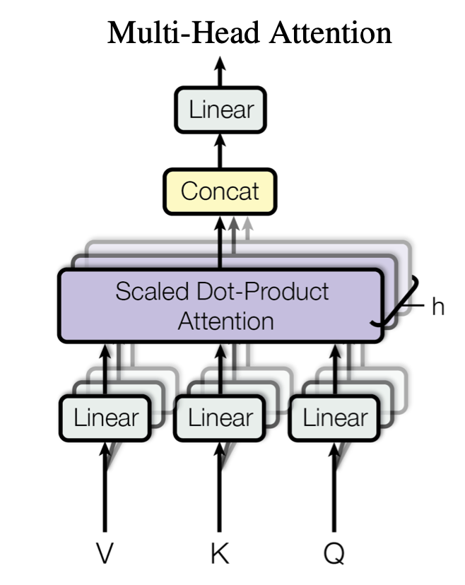

# Transformers
An implementation of the original transformer architecture from the [Attention is all you need](https://proceedings.neurips.cc/paper/2017/file/3f5ee243547dee91fbd053c1c4a845aa-Paper.pdf) paper.

## Multi-Head Attention mechanism
Implemented as `SelfAttention()` class in `transformer.py`.

